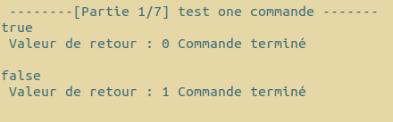
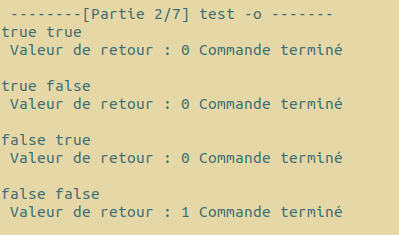
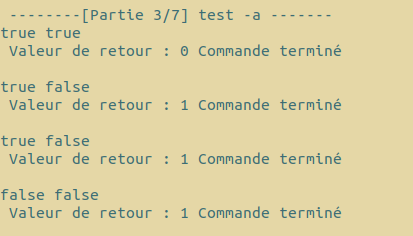
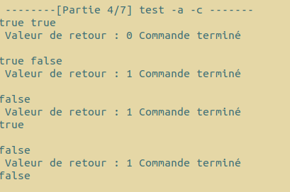
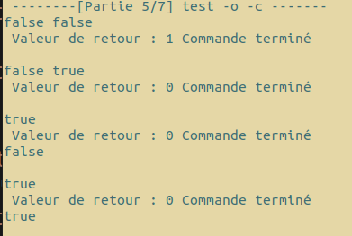
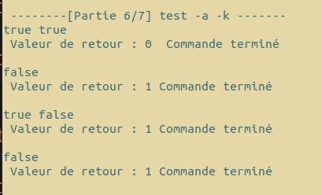
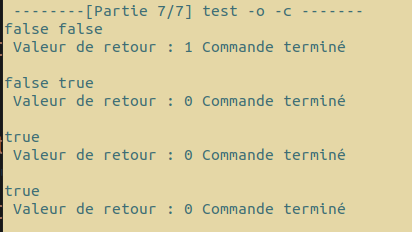

#   `do`

## Membres du groupe

Ce travail est à réaliser en équipe dont les membres sont :

- BENEDICTUS KENT **RACHMAT**
- HICHEM **KARFA**

##  Compte-rendu 

-- La section 1 contient les questions traitées ainsi que le rapport pour chaque question <br/>
-- La section 2 contient les questions non traitées <br/>
-- La section 3 contient les notions apprises<br/>
-- La section 4 contient les commandes à effectuer pour lancer les programmes ainsi que les tests

# Section 1 : Questions traitées et tests effectuées

<h3> 1. do (Fonctionnelle) : <br/> </h3>
Pour <strong>do</strong> nous avons non seulement réalisé le code, mais en plus écrit un script nommé <strong>tests.sh</strong> permettant de lancer les tests.


<h4>  fonctionnement du script : </h4> 

le script est divisé en sept parties :

Chaque partie représente une combinaison d'arguments possible de la commande __do__ par exemple `./do -a ` ou `./do -o`.

Dans chacune des parties nous lançons la commande ` do `avec comme autres arguments **sleepAndDisplay** qui est un programme prennant deux arguments.

- le premier argument est la valeur de retour de la fonction __true_  pour ```EXIT_SUCCESS``` ou __false__ pour ```EXIT_FAILURE```.

- le second argument est le temps en seconde que le programme va attendre avant de finir.

Puis nous testons différents cas possibles dans chaque partie pour tester les diffident cas de test.

Voici le résultat de chaque partie :


<h4>Partie 1:  `./do` exécutions d'une seule commande </h4>

Résultat du test : 
On peut voir que les commandes s'exécutent normalement, le code de retour et celui attendu.




<h4>Partie 2: `/do` en mode `-o` </h4>

Résultat du test :
le programme retourne bien la disjonction des status retourné par les commandes.
Il suffit qu'un programme finisse avec `exit_succes `pour que le programme en fait de même.




<h4>Partie 3: `./do` en mode `-a `</h4>

Résultat du test :
le programme retourne bien la conjonction  des status retourné par les commandes.
Il suffit qu'un programme finisse avec `exit_faillure `pour que le programme en fait de même.




<h4>Partie 4: `./do`  en mode`-a -c `</h4>

Résultat du test :
Le programme retourne bien la conjonction  des status retourné par les commandes.<br/>
Le coupe circuit fonctionne également.
Il suffit qu'un programme finisse avec `exit_faillure `pour que le programme s'arrête et en fait de même.<br/>
Nous pouvons aussi constater que même quand le programme finit, les processus sont toujours en vie et affiche leur résultat une fois qu'ils ont fini.





<h4>Partie 5: `./do`  en mode `-o c `</h4>

Résultat du test :
Le programme retourne bien la disjonction des status retourné par les commandes.<br/>
Le coupe circuit fonctionne également.
Il suffit qu'un programme finisse avec `exit_succes `pour que le programme s'arrête et en fait de même.<br/>
Nous pouvons aussi constater que même quand le programme finit, les processus sont toujours en vie et affiche leur résultat une fois qu'ils ont fini.




<h4>Partie 6: `./do`  en mode `-a -k` </h4>

Résultat du test : 

Le programme retourne bien la disjonction des status retourné par les commandes.<br/>
Le kill fonctionne également.
Il suffit qu'un programme finisse avec `exit_faillure `pour que le programme s'arrête et en fait de même.<br/>
Nous pouvons aussi constater que cette fois-ci quand le programme finit, les processus sont tués et aucun message ne s'affiche.




<h4>Partie 7: `./do` en mode `-o -k` </h4>

Résultat du test : 
Le programme retourne bien la disjonction des status retourné par les commandes.<br/>
Le kill fonctionne également.
Il suffit qu'un programme finisse avec `exit_succes `pour que le programme s'arrête et en fait de même.<br/>
Nous pouvons aussi constater que cette fois-ci quand le programme finit, les processus sont tués et aucun message ne s'affiche.




# Section 2 : Questions non-traitées

Tout le code est fonctionnel et toutes les questions ont été traitées.

# Section 3 : Notions

Nous avons appris à manipuler les processus lourds.

Notamment en utilisant les commandes execvp(), kill().


# Section 4 : Commande

Pour compiler les sources, placez-vous dans le dossier do et utilisez la commande :

```bash
make
```

Voici les commandes pour :

exécuter la commande do :
<br/>
```bash
./do {cmd1,cmd2,...} 
```

Exécuter le test :

```bash
./tests.sh
```
