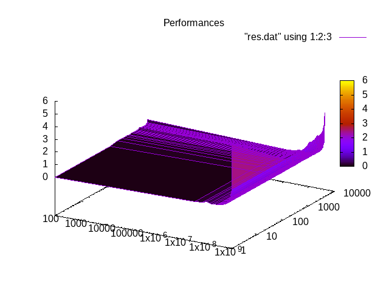

# Processus légers

Ce dépôt correspond aux TP de PDS sur le thème
« [Processus légers](https://www.fil.univ-lille1.fr/~hym/e/pds/tp/tdth1.html) ».

## Membres du groupe

Ce travail est à réaliser en équipe dont les membres sont (**groupe 7 du S5 Licence 3 Informatique**) :

- BENEDICTUS KENT **RACHMAT**
- HICHEM **KARFA**

### Calcul du taux de G / C

Pour compiler les différents fichiers, utilisez la commande suivante :

```bash
$ > make
```

#### Question 1

Pour utiliser notre programme `compteur-gc-multithreaded.c`, exécutez la commande suivante :

```bash
$ > ./aleazard n > genome
```

Où `n` représente le nombre de caractères voulu.

```bash
$ > ./compteur-gc-multithreaded genome nbThreads
```

Où `nbThreads` représente le nombre de threads voulu.

#### Question 2

Pour analyser les performances des threads, nous avons créé un script `script.sh` qui génère des génomes de tailles variables, et qui calcule les performances avec différents nombres de threads.<br/>
Le fichier `genome` est volontairement supprimé à la fin du script car ce dernier pèse 1 Go.

Pour utiliser le script `script.sh`, exécutez la commande suivante :

```bash
$ > ./script.sh
```

Vous trouverez le résultat des performances dans le dossier `images`.<br/>
<br/>
Voici les résultats que nous avons obtenus :



Nous pouvons constater qu'avec un jeu de données assez grand nous observons une augmentation des performances (diminution du temps d'exécution) en fonction du nombre de threads créés. Cette croissance de performances stagne et diminue à partir de 1000 threads créé.

Conclusion :

L'augmentation du nombre de threads permet bien de séparer les tâches entre les différents threads afin de diminuer le temps d'exécution, cependant un nombre très élevé de thread réduit drastiquement les performances cela s'explique par le fait que la création et l'attente d'un nombre élevée de threads prennent plus de temps que l'exécution de la tâche en elle-même. Il faut donc trouver un bon équilibre de thread à créer pour avoir un temps d'exécution optimal.

# Rendez-vous

Le code est bien implémenté, grâce à la méthode sémaphore on peut gérer le flux du thread dans notre code, pour exécuter cet exercice merci d'utiliser la commande ci-dessous :

```bash
$ > ./rdvQ4
```

De plus, vous pouvez exécuter les questions 1 et 3 en utilisant `./rdv` et `./rdvQ3`

# Question de TD

#### Question 4

4.1) Certains threads peuvent être effectués avant la fin du thread précédent, donc pour éviter ce problème, on peut utiliser la fonction de sémaphore.<br/>
4.2) static nous permet de rendre la variable count globale.<br/>
4.3) `printf("%d\n",count);` nous permet de voir la valeur de count.<br/>

pour voir le résultat vous pouvez utiliser la commande ci-dessous :

```bash
$ > ./TDexo4
```

#### Question 5

Pour voir le nouveau mécanisme pour la fonction fibonaci qui a discuté en classe vous pouvez exécuter ce commande :

```bash
$ > ./fib
```
