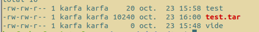
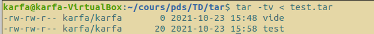
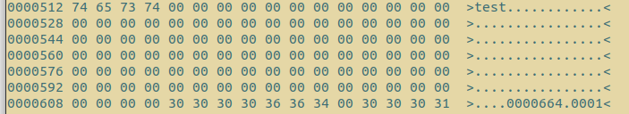
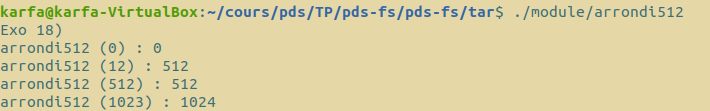
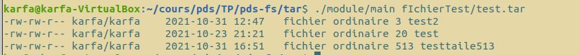
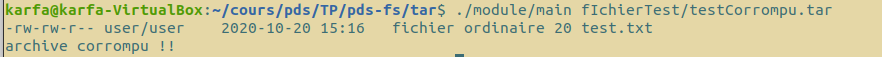

## Membres du Groupe

Ce travail est à réaliser en équipe dont les membres sont (**groupe 7 du S5 Licence 3 Informatique**) :

- BENEDICTUS KENT **RACHMAT**
- HICHEM **KARFA**

# Structure du Dossier :

- `fIchierTest` : Ce dossier contient nos différents fichiers de tests.
- `Images` : Ce dossier contient les images des différents tests effectués.
- `main.c` : La fonction principale permettant d'appeler une version de lstar.
- `Makefile` : Le makefile permettant de générer l'exécutable.
- `RAPPORT.md` : Notre compte rendu du TP.
- `src` :
  - arrondi.c / arrondi.h : La fonction permettant d'arrondir un entier n au multiple de 512 supérieur.
  - lstar.c / lstar.h : Différentes versions de lstar
  - util.c / util.h : Différentes fonctions permettant d'obtenir certaines informations nécessaires aux fonctions lstar.
  - struct.h : La structure posix

# Section 1 : Questions traitées

## Exercice 17

Voici les commandes pour :

- Créer une archive

```bash
$ > tar -H ustar -c vide test > test.tar
```

l'option -H permet de préciser le format, dans notre cas nous utiliserons la variante UStar.<br/>
l'option -c permet de créer une nouvelle archive, les arguments `vide` et `test` sont les fichiers à archiver.

Nous obtenons donc une archive nommé `test.tar` :



- Lister le contenu de l’archive :

```bash
$ > tar -tv < test.tar
```

l'option -tv permet de lister le contenu de l'archive.

Nous pouvons voir nos deux fichiers `test` et `vide` avec des informations comme les droits, la taille(20 pour `test` et 0 pour `vide`), le temps où le fichier est créé, le nom du fichier, et le nom de l'utilisateur des fichiers :



- Lire le contenu :

```bash
$ > od -Ad -t x1z -v test.tar
```

l'option -Ad permet de selectionner la base dans laquelle les décalages sont affichées (décimale).<br/>
l'option -t permet de selectionner le format d'affichage des résultats (héxadécimales).<br/>
l'option -v permet d'afficher les lignes identiques consécutives (à la place de \*).

Nous pouvons ainsi retrouver à la position 512 le nom du fichier `test` et le mode à la position 612 (512 + 100). :



## Exercice 18

Voici les tests de notre fonction arrondi512 :



## Exercice 19

```bash
$ > tar -H ustar -c fIchierTest/test | ./module/main
Size : 20
$ > tar -H ustar -c fIchierTest/vide | ./module/main
Size : 0
```

## Exercice 20

```bash
$ > tar -H ustar -c fIchierTest/vide fIchierTest/test | ./module/main
Size : 0
Size : 20
```

## Exercice 21 / 22 / 23

```bash
$ > ./module/main fIchierTest/test.tar
```



## Exercice 24

```bash
$ > ./module/main fIchierTest/testCorrompu.tar
```



# Section 2 : Questions non-traitées

Toutes les questions ont été traitées.

# Section 3 : Notions 

- Le format d'archives Tar et sa structure .
- La variante UStar.
- L'outil od.

# Section 4 : Commandes

Pour compiler les sources placez-vous dans le dossier tar et exécuter la commande suivante :

```bash
$ > make
```

Pour passer en arguments de la fonction l'archive voici la commande :

```bash
$ > ./module/main <Pathname_Archive>
```

Par exemple, avec nos fichiers test qui se trouve dans le dossier :

```bash
$ > ./module/main fIchierTest/test.tar
```

Vous pouvez aussi utiliser la commande avec des flux voici un exemple :

```bash
$ > tar -H ustar -c fIchierTest/test fIchierTest/testtaile513  | ./module/main
```
