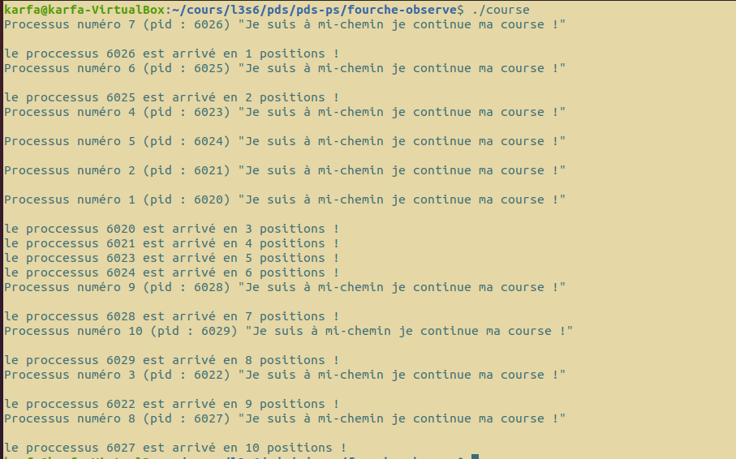

#   `multif`, course et observation

## Membres du groupe

Ce travail est à réaliser en équipe dont les membres sont :

- BENEDICTUS KENT **RACHMAT**
- HICHEM **KARFA**

##  Compte-rendu 

-- La section 1 contient les questions traitées ainsi que le rapport pour chaque question <br/>
-- La section 2 contient les questions non traitées <br/>
-- La section 3 contient les notions apprises<br/>
-- La section 4 contient les commandes à effectuer pour lancer les programmes ainsi que les tests

# Section 1 : Questions traitées et tests effectuées

<h3> 1. multif (Fonctionnelle) : <br/> </h3>
Pour __multif__ nous avons non seulement réalisé le code, mais en plus écrit un script nommé __tests.sh__ permettant de lancer les tests.

<strong> ___ fonctionnement du script ___</strong> : <br/>

le script est divisé en trois parties :

Partie 1: Test de la valeur de retour de __multif__<br>
le script exécute __multif__ avec un jeu de données permettant de tester différents cas, si la valeur de retour de __multif__ est celle attendue alors il affiche un message indiquant que le test est bon (fok)
et affiche les arguments donnés à __multif__.<br/>
Si le test échoue il envoie le même message, mais en indiquant le test a échoué (error)


Partie 2:
Dans un second temps, le test vérifie que les fonctions s'exécutent bien en "parallèle".<br/>
Pour cela multif s'exécute avec deux fonctions qui attendent chacune 5 secondes et nous testons le temps d'exécution de la commande. <br/>
Si le temps est proche de 5 secs c'est que les deux fonctions s'exécutent de manière parelle, et s'il est proche de 10 il est fort probable que les fonctions s'effectuent les unes après les autres.<br/>
Nous affichons donc dans le script le temps d'exécution de la fonction.

Partie 3:
cette étape permet seulement de tester le script en lui-même en vérifiant que lors de la 1re étape, le script affiche bien le message d'erreur si la valeur attendue n'est pas la même que celle-ci retourne

<h3> 2. course (Fonctionnelle) : <br/> </h3>



Nous avons pu constater qu'à chaque lancement du programme n'importe quel processus pouvait arriver à compter jusqu'à 100 millions en premier, par exemple dans l'image ci-dessus nous pouvons voir que le 7eme processus lancé est arrivé en premier. <br/>
Ce qui signifie que ce n'est pas forcément le premier processus créé qui finira le premier de la course donc nous ne pouvons donc pas prédire en avance l'ordre d'exécution des processus. <br/>

Nous pouvons aussi voir que les processus se lance de manière parallèle.

Pour conclure nous voyons que même si un processus arrive premier en mi-chemin, il n'est pas assuré d'arriver premier à la fin de course, prédire un ordre d'arrivée des processus n'est donc pas possible du début à la fin.


<h3> 3. observe (Fonctionnelle) : <br/> </h3>

Voici les réponses aux questions posée :

Question 1 :
- Création des processus fils
- Chaque processus affiche leurs PID et s'endorme pendant 5 seconde en boucle
- Affichage des processus actifs du terminal, une fois tous les processus crée
- Attente de la terminaison des fils

Question 2 :<br/>
Si on tue le processus père, les processus fils continuent à afficher leurs PID, ils deviennent alors orphelins et leurs ppid est égal à 1.

Question 3 : <br/>
Si on tue l'un des fils avant de faire le wait, le processus ne continuent plus à s'exécuter, 
cependant nous pouvons toujours le voir avec la commande `ps -a` mais il est dans l'état defunct, c'est-à-dire l'état zombie.

Une fois que nous reprenons le programme et la terminaison du processus via le père nous pouvons constater que le fils n'existe plus.

# Section 2 : Questions non-traitées

Tout le code est fonctionnel et toutes les questions ont été traitées.

# Section 3 : Notions

Nous avons appris à manipuler les processus lourds.

Notamment en utilisant les commandes fork(), wait().

Nous avons appris aussi des notions comme un processus orphelin et zombie.

# Section 4 : Commande

Pour compiler les sources, placez-vous dans le dossier fourche-observe et utilisez la commande :
```bash
make
```

Voici les commandes pour :

exécuter la commande multif :
<br/>
```bash
./multif {true,false,sleep5}
```


Exécuter la commande course :
```bash
./course
```

Exécuter la commande observe :

```bash
./observe
```

Exécuter le test :

```bash
./tests.sh
```
