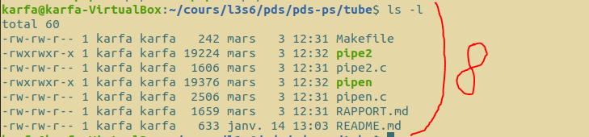
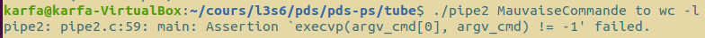
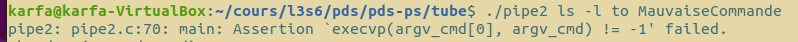
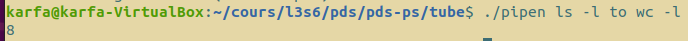
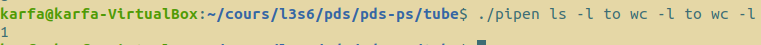
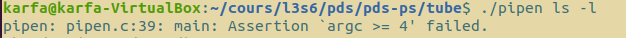

#   `pipe`

## Membres du groupe

Ce travail est à réaliser en équipe dont les membres sont :

- BENEDICTUS KENT **RACHMAT**
- HICHEM **KARFA**

##  Compte-rendu 

-- La section 1 contient les questions traitées ainsi que le rapport pour chaque question <br/>
-- La section 2 contient les questions non traitées <br/>
-- La section 3 contient les notions apprises<br/>
-- La section 4 contient les commandes à effectuer pour lancer les programmes ainsi que les tests

# Section 1 : Questions traitées et tests effectuées

Voici une batterie de tests que nous avons réalisés pour nous assurer que le code fonctionne correctement :

### pipe2

- Connexion de deux commandes par un tube anonyme : 

On peut voir sur la premiere image que la commande __ls -l__ affiches 8 lignes 



En combinant __ls -l__ avec __wc -l__ on peut voir que la commande affiche bien ce numéro 


La sortie standard de la première à bien été redirigé commande vers un tube anonyme depuis lequel est redirigée l’entrée standard de la seconde commande.

Voici les différents cas de tests:

- Cas avec une commande 


- Cas si l'une des commandes ne fonctionne pas 







----------------------------------------------------------------
### pipen

- cas avec deux commandes :



- cas avec trois commandes  :



- cas avec quatres commandes  :


- Cas avec une commande :




- Cas si l'une des commandes ne fonctionne pas 


# Section 2 : Questions non-traitées

Tout le code est fonctionnel et toutes les questions ont été traitées.

# Section 3 : Notions

- Création d'un tube 

- Duplication d'un descripteur de fichier 

- Communication entre processus via un tube 


# Section 4 : Commande

Pour compiler les sources, placez-vous dans le dossier tube et utilisez la commande :

```bash
make
```

Voici les commandes pour :

exécuter la commande pipe2 :

```bash
./pipe2 command1 to command2
```

exécuter la commande pipen :

```bash
./pipen command1 to command2 to command3 to command4 to ...
```
